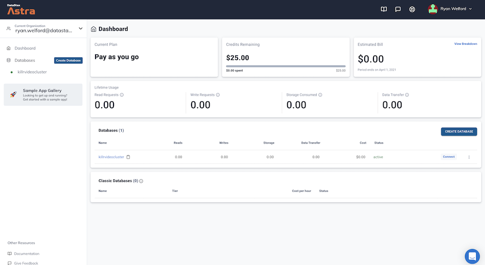

# Cassandra Node.js drivers practice

Hello and welcome!
This is the companion repository for the "Cassandra Node.js drivers practice"
presentation.
In this repository you'll find all code snippets for you to get some practice
and follow along - plus instructions to repeat the practice on your own!

You will complete this practice with a good understanding of what you can do,
and how, with the Node.js drivers for Apache Cassandra™.

For the complete **driver documentation**, please go
[here](https://docs.datastax.com/en/developer/nodejs-driver/4.6/)
and start exploring.

To get the **presentation slide deck**, click
[here](presentation/cassandra-nodejs-drivers-presentation.pdf).

This practice will be done on your own computer: you will need

- a working internet connection
- `Node.js` v15+
- `npm` v 7+

**Note**: don't worry if you don't have an Apache Cassandra™ installation
handy! Indeed, you can create your very own **Astra DB** database in
the cloud FOR FREE, which is a Database-as-a-service built on Apache Cassandra™,
and is perfect for the exercises (and not only...).

We will guide you through creation and setup of your Astra DB instance
momentarily.

## 1. Set up your environment

This is a practice session: we will not provide a `package.json` file
nor a full-fledged running app. You will have to follow some instructions
to set up your environment from scratch.

First install some dependencies:

    npm install cassandra-driver@4.6.3
    npm install express@4.17.1

You now have the Cassandra drivers ready to use! (As for `express`, it
will be needed for one of the demos later).
You will run the following practice in this directory, in a Node REPL if you
prefer.

## 2. Create & connect your database

We will guide you through creation of your Astra DB instance, which will act
as a Cassandra database in the cloud, ready for our experiments. Of course,
everything you see here will run as well with a regular Cassandra database.

The following instructions are for Astra DB: to work with standard Cassandra,
please skip to subsection "2c. Connecting to a Cassandra DB".

### 2a. Creating your Astra DB instance

_**`ASTRA DB`** is the simplest way to run Cassandra with zero operations at all - just push the button and get your cluster. No credit card required, $25.00 USD credit every month, roughly 5M writes, 30M reads, 40GB storage monthly - sufficient to run small production workloads._

✅ Register (if needed) and Sign In to Astra DB [https://astra.datastax.com](https://astra.datastax.com/): You can use your `Github`, `Google` accounts or register with an `email`.

_Make sure to chose a password with minimum 8 characters, containing upper and lowercase letters, at least one number and special character_

✅ Choose "Start Free Now"

Choose the "Start Free Now" plan, then "Get Started" to work in the free tier.

You will have plenty of free initial credit (renewed each month!), roughly corresponding
to 40 GB of storage, 30M reads and 5M writes.

> If this is not enough for you, congratulations! You are most likely running a mid- to large-sized business! In that case you should switch to a paid plan.

(You can follow this [guide](https://docs.datastax.com/en/astra/docs/creating-your-astra-database.html) to set up your free-tier database with the $25 monthly credit.)

<details>
    <summary>👁️ Signup screenshot (click to expand)</summary>
    
</details>

To create the database:

- **For the database name** - `nodepractice`.

- **For the keyspace name** - `chemistry`. The code below assumes this keyspace name, so please try not to be creative this time

| Parameter | Value 
|---|---|
| Database name | nodepractice |
| Keyspace name | chemistry |

_You can technically use whatever you want and update the code to reflect the keyspace. This is really to get you on a happy path for the first run._

- **For provider and region**: Choose and provider (either GCP, AWS or Azure). Region is where your database will reside physically (choose one close to you or your users).

- **Create the database**. Review all the fields to make sure they are as shown, and click the `Create Database` button.

You will see your new database `pending` in the Dashboard.

<details>
    <summary>👁️ Database in "pending" state (click to expand)</summary>
    
</details>

The status will change to `Active` when the database is ready, this will only take 2-3 minutes. You will also receive an email when it is ready.

<details>
    <summary>👁️ DB creation walkthrough (click to expand)</summary>
    
</details>

### 2b. Connecting to Astra DB

Now prepare an environment file defining some variables to make it easy
to connect to the database from the Node code samples.

#### Token

You need to go to the Astra DB interface and generate a **token**:
the information in the token (specifically, the "Client ID" and
"Client Secret"), together with a "bundle" containing some certificates, will
provide authentication when connecting to the database from your computer.

_Note_: once the token is created, please store it in a safe place (the Astra
console won't show it again) and keep it as private as a password! You can
download the token data in CSV format from the token generation page.

To create the token from your main dashboard (where your databases are listed)
simply click on the "..." menu next to your database and choose "Generate a token".
Choose the role "Database Administrator" and click on "Generate Token".

_Alternatively, go to the Astra dashboard, open the Organization menu on the
top left and choose "Organization settings", then "Token Management" and finally
you will be able to generate a new token. Choose the role "Database Administrator"._

Download the token in CSV format and/or copy
its value to a handy place such as a text editor: we will use it immediately!

_See this [documentation](https://docs.datastax.com/en/astra/docs/manage-application-tokens.html) to create your application token._ 

**Once you have your token**, create a file `.env`
(you can use the `.env.sample` as template) and make
sure you set Client ID and Client Secret to the ones for your token.

#### Secure Connect Bundle

The other piece needed is the SCB, a zip file containing certificates needed
for the authentication to work. Go to your Astra DB console, choose your
`nodepractice` database and pick the "Connect" tab. In the menu, click on
the "Connect using a driver / Node.js" item and the main page
will give you the option to "Download your Secure Connect Bundle".

<details>
    <summary>👁️ Getting the Secure Connect Bundle (click to expand)</summary>
    
</details>

**Download the file** and store it somewhere in your file system; then,
make sure you edit the `.env` file with the full path to this file.

The `.env` file is now ready to be used! Source it with

    . .env

(you will have to source the file for any shell in which you need to connect
to Astra DB).

_Note_: if you want/need to define the environment variables in another way, no
problem! For instance, if you are running Windows, the syntax to export the
three environment variables `SECURE_CONNECT_BUNDLE`, `ASTRA_DB_CLIENT_ID` and
`ASTRA_DB_CLIENT_SECRET` is different and you will have to adapt
the above instructions. If you prefer, you could also simply hardcode three
strings in the Node code - though this is a _Very Bad Practice™_.

### 2c. Connecting to a Cassandra DB

If you want to practice with a standard Cassandra installation instead,
you will need the IP address(es) of at least one of the nodes in the cluster,
plus any other authentication mechanism configured on the cluster.

Assuming there is no authentication at all (which is admissible only for a
test cluster!), to connect to the database you will have to use a `config`
set of options similar to the following (details may vary depending
on your database's configuration):

    const config = {
        // one or more node IP addresses here
        contactPoints: ['12.34.56.78', '78.56.34.12'],
        localDataCenter: 'datacenter1',
        keyspace: 'chemistry'
    };

This `config` will have to replace the one found in this repo's code snippets,
which  are written to read the Astra DB environment variables and connect to
that database. (See "4a. A first reading" below for a working example)

## 3. Prepare your database

You are almost ready to start accessing your database using the drivers:
but first, create a table and put some test data in it.

### 3a. Keyspace creation (Cassandra only)

_Note._ If you are using a default Cassandra installation instead of Astra DB,
you will have to create the `chemistry` keyspace yourself. To do so, open a
`cqlsh` console and enter the following command:

    // Run if not using Astra DB
    // Adjust the replication factor to 3 or the number of nodes in your cluster, whichever is smaller:
    CREATE KEYSPACE chemistry WITH REPLICATION = {'class': 'SimpleStrategy', 'replication_factor': 2};

### 3b. Table creation

The following commands, instead, are to be run regardless of whether you're on Astra DB or not.

Open a CQL Console to interact with the database: on Astra, this is a Web-based console
and is reached through the "CQL Console" next to the "Connect" tab in your database view.
If you are using default Cassandra, the exact way to launch `cqlsh` will vary.

In any case, you will now work in the `chemistry` keyspace and create a table
for chemical elements:
```
USE chemistry;

CREATE TABLE elements (
    symbol TEXT PRIMARY KEY,
    name TEXT,
    atomic_mass DOUBLE,
    atomic_number INT
);
```

You can check the table with `DESCRIBE TABLE elements;`.

_Note._ You may find it convenient to keep the CQL Console running
all the time, to be able to double-check the contents of the table against
operations performed with the Node drivers.

### 3c. Populate the table

Import the data found in file [`elements.csv`](data/elements.csv) into
the table. To do so, click on "Load Data" in your Astra console:
you will then supply the CSV file and click "Next".

You can now look at a sample of the data you're about to import; check
the table name is `elements` and choose `symbol` as partition key, then
click "Next".

Finally pick `nodepractice` as the target database and `chemistry` as
the keyspace, and click "Next". The data import job will take a few minutes,
after which you'll be notified by email. You can also check that the table
has been filled with a simple query in the CQL Console:

    USE chemistry ;
    SELECT * FROM elements LIMIT 10; 

Once you see results, the import has finished.

<details>
    <summary>👁️ Loading data (click to expand)</summary>
    
</details>

_Note._ If you are using a default Cassandra installation instead of Astra DB,
the above import procedure is replaced by a command in the CQL shell: assuming
it has access to the file, and that you are on the `chemistry` keyspace, run
the following:

    // Run if not using Astra DB
    COPY elements FROM 'elements.csv' WITH HEADER=TRUE;

**Code snippet**: The CQL commands are found in [`setup.cql`](code/01_setup/setup.cql).

## 4. Now for the practice!

You are finally ready to try out some code! We will connect to the database
and perform various queries to read and write data.

_Note._ The Node.js Cassandra drivers work either with callback or with
promises: to keep the code simple and to the point, in the following snippets
we generally don't deal with clean shutdown of resources
(i.e. `client.shutdown()`). In a running script you may want to be more
parsimonious.

We assume you are familiar with Node.js enough to figure out how to adapt
the code snippets below for running interactively in a REPL, line-by-line.

### 4a. A first reading

To test connectivity, let us run a simple script that reads and outputs
the chemical elements from the table:

    node code/02_connect/connection_astra.js

_Note._ If you are using a default Cassandra installation, run

    node code/02_connect/connection_cassandra.js

after having adjusted the `config` object defined therein.

### 4b. Run some queries

From this point onward, code snippets will be connecting to Astra DB
by default: to change them into accessing Cassandra, you will have to
comment one `config` and uncomment+adjust the other `config`.

What follows can be run as a single Node invocation with

    node code/03_queries/queries.js

however, it is perhaps more instructive to open a REPL and paste commands
piecewise to see what each block does. You will see, in this order,
code snippets that achieve the following:

- create a new `metals` table - CQL check with `DESCRIBE TABLES`
- insert a row in it with a "questionable" statement - CQL check with `SELECT * FROM METALS;`
- insert another row with a more gracious syntax
- insert another row with a prepared statement, with array- and object-based parameters
- insert a row with an idiomatic promise-based construct
- insert a row with an idiomatic callback-based construct
- read rows with promises
- read rows with callbacks
- read rows with `eachRow()`
- executes a sample batch

### 4c. A simple API

You may have noticed that the `metals` table got hijacked by someone trying
to squeeze metal _music_ into it. Problem is, you are asked to write a small
REST API to expose the "actual metals" part of the table.

Fortunately for you, by staying in the partition with `kind = 'regular'`, you
will be working with actual metals. And, even better, the API is there, waiting
for you to start it!

The API uses Express and holds a `Client` instance, used to access the
underlying database. Please, go ahead and peek at the code, which in the
meantime you can start with:

    node code/04_api/api.js 

The API server is up and running, ready to accept requests. You can now test
it, for example from another shell with the following CURL commands
(the ` | jq` part is optional, just to have a better formatting of
the responses):

```
    # get all metals
    curl localhost:5000/metal | jq

    # get a metal
    curl localhost:5000/metal/silver | jq

    # insert a new metal (pssst: "armonium" is a made-up metal!)
    curl -XPOST localhost:5000/metal \
      --data '{"density": 101.11, "name": "armonium"}' \
      -H "Content-Type: application/json" | jq

    # get the listing again
    curl localhost:5000/metal | jq
```

If everything seems to work, you can now stop the API with Ctrl-C.

### 4d. More driver options

In the **code snippet**
[`policies_and_options.js`](code/05_driver_options/policies_and_options.js)
you find examples of how to set explicit load balancing policies, reconnection
policies and retry policies. Additional query options are illustrated.

Please note that for the code to run as it is you should check that the
datacenter mentioned in the code (`'eu-west-1`) is changed to reflect
the region your Astra DB is in -- or the name of your datacenter for a
standard Cassandra installation.

Similarly, to make the code snippet
[`execution_profiles.js`](code/05_driver_options/execution_profiles.js)
work you might have to edit the datacenter name in the code.

### 4e. Pagination

Pagination helps when you want to fetch more results than those fitting
a single page of results (which defaults to `fetchSize = 5000`).

#### Automatic paging

Use the `for await ... of` construct:

    node code/06_pagination/pagination-for-await.js

Also passing `autoPage: true` to `eachRow()` does the job:

    node code/06_pagination/pagination-eachRow.js

#### Manual paging

In some cases you want to store a page state and use it later: see

    node code/06_pagination/manual-passing-pageState.js

Alternatively, you can see this `eachRow`-based example:

    node code/06_pagination/manual-eachRow-nextPage.js

If you do heavy processing of incoming items, and want to prevent piling up
results in the local buffer, have a look at this `stream`-based idiom:

    node code/06_pagination/manual-stream.js

## 5. The End

Congratulations!
You have now seen the main ways you can use drivers to access Cassandra from
your Node.js application.

But there's more to it!
We encourage you to dive into the
[documentation](https://docs.datastax.com/en/developer/nodejs-driver/4.6/).

Have fun writing your application!

> The DataStax Developers
