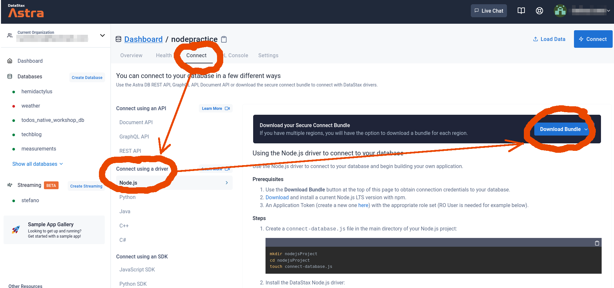
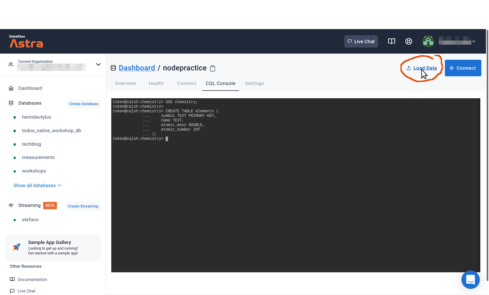

# Versão em Português do workshop Cassandra driver javascript node.js

Olá e bem-vindo!

Este é o repositório complementar para a apresentação prática dos drivers Cassandra em Javascript / Node.js.

Neste repositório você encontrará todos os trechos de código para você praticar e acompanhar.

> Além disso também disponibilizamos instruções para repetir a prática por conta própria!

Você concluirá esta prática com uma boa compreensão do que pode fazer,
e como, com os drivers Node.js para Apache Cassandra™.

## Documentação oficial
Node.js driver
- [https://docs.datastax.com/en/developer/nodejs-driver/4.6/](https://docs.datastax.com/en/developer/nodejs-driver/4.6/)

## Slides
slides usados na aprentação

- [presentation/cassandra-nodejs-drivers-presentation.pdf](presentation/cassandra-nodejs-drivers-presentation.pdf).

## Requisitos
Para praticar você precisa:

- internet (*o banco de dados Apache Cassandra usado aqui está na nuvem*)
-  o Node.js LTS (ou superior) https://nodejs.org/en/

**Nota**: crie sua instância do Apache Cassandra chamado **AstraDB** 
de graça. https://astra.datastax.com/
> Você ganha $25 todo mês em créditos (isso dá até 80GB por mês **na faixa**)

## 1. Configurando o ambiente

> Sugestão: use o Linux, Mac ou WSL/Windows

Começamos com a instalação básica dos componentes:

```shell
mkdir code-pt-br
cd code-pt-br
npm init -y
npm i cassandra-driver express
```

## 2. Passo a passo para criar a infraestrutura

O AstraDB é a maneira mais simples de executar o Cassandra com zero instalações - basta apertar o botão e obter seu cluster. 
Não é necessário cartão de crédito, e você ganha crédito de US$ 25,00 todos os meses. Isso é aproximadamente:
- 5 milhões de gravações, 
- 30 milhões de leituras, 
- 40 GB de armazenamento mensal

### Site
✅ Acesse o seu banco de dados em [https://astra.datastax.com](https://astra.datastax.com/)

- Você pode logar com seu `Github`, `Google` ao invés de criar mais uma combinação `email e senha`.

<details>
    <summary>Se for sua primeira vez acessando o site, clique aqui</summary>
    
    
    
</details>

### O banco
> **A interface em https://astra.datastax.com está em Inglês**. Vamos lá:


- ✅ Clique em um dos botões que com **CREATE DATABASE** ou **CREATE SERVERLESS DATABASE** (ambos são equivalentes)
- ✅ Vamos dar nomes
  - DATABASE NAME: `workshop` 
  - KEYSPACE NAME: `demo`
> Sugiro escolher `NORTH AMERICA` e depois `MONCKS CORNER (us-east1)`
  - ✅ Clique no botão bem a direita **CREATE DATABASE**


#### Nota
⚠️ Como usuário do plano FREE, você pode usar **GCP** e **qualquer Area ou Região que esteja destravada**

- Se você quiser **GCP** > `SOUTH AMERICA` > `SAO PAULO (southamerica-east1)`, sugiro cadastrar o cartão de crédito
- Se você quiser **AWS** ou **AZURE** > `*qualquer região*` > `*qualquer área*`, sugiro cadastrar o cartão de crédito

### O banco de dados já está ativo?
Você verá seu novo banco de dados pendente no Painel.

O status mudará para Ativo quando o banco de dados estiver pronto, isso levará apenas 2-3 minutos. Você também receberá um e-mail quando estiver pronto.


## 🥳 Conectando ao banco de dados

Now prepare an environment file defining some variables to make it easy
to connect to the database from the Node code samples.

#### Token

You need to go to the Astra DB interface and generate a **token**:
the information in the token (specifically, the "Client ID" and
"Client Secret"), together with a "bundle" containing some certificates, will
provide authentication when connecting to the database from your computer.

_Note_: once the token is created, please store it in a safe place (the Astra
console won't show it again) and keep it as private as a password! As long as you have not yeat left the page, you can also
download/save the token data in CSV format.

To create the token from your main dashboard (where your databases are listed)
simply click on the "..." menu next to your database and choose "Generate a token".
Choose the role "Database Administrator" and click on "Generate Token".

_Alternatively, go to the Astra dashboard, open the Organization menu on the
top left and choose "Organization settings", then "Token Management" and finally
you will be able to generate a new token. Choose the role "Database Administrator"._

Download the token in CSV format and/or copy
its value to a handy place such as a text editor: we will use it immediately!

_See this [documentation](https://docs.datastax.com/en/astra/docs/manage-application-tokens.html) to create your application token._ 

**Once you have your token**, create a file `.env`
(you can use the `.env.sample` as template) and make
sure you set Client ID and Client Secret to the ones for your token.

#### Secure Connect Bundle

The other piece needed is the SCB, a zip file containing certificate
and settings needed
for the authentication to work. Go to your Astra DB console, choose your
`nodepractice` database and pick the "Connect" tab. In the menu, click on
the "Connect using a driver / Node.js" item and the main page
will give you the option to "Download your Secure Connect Bundle".

<details>
    <summary>👁️ Getting the Secure Connect Bundle (click to expand)</summary>
    
</details>

**Download the file** and store it somewhere in your file system; then,
make sure you edit the `.env` file with the full path to this file.

The `.env` file is now ready to be used! Source it with

    . .env

(you will have to source the file for any shell in which you need to connect
to Astra DB).

_Note_: if you want/need to define the environment variables in another way, no
problem! For instance, if you are running Windows, the syntax to export the
three environment variables `SECURE_CONNECT_BUNDLE`, `ASTRA_DB_CLIENT_ID` and
`ASTRA_DB_CLIENT_SECRET` is different and you will have to adapt
the above instructions. If you prefer, you could also simply hardcode three
strings in the Node code - though this is a _Very Bad Practice™_.

## 3. Prepare your database

You are almost ready to start accessing your database using the drivers:
but first, create a table and put some test data in it.

### 3a. Keyspace creation (Cassandra only)

_Note._ If you are using a default Cassandra installation instead of Astra DB,
you will have to create the `chemistry` keyspace yourself. To do so, open a
`cqlsh` console and enter the following command:

    // Run if not using Astra DB
    // Adjust the replication factor to 3 or the number of nodes in your cluster, whichever is smaller:
    CREATE KEYSPACE chemistry WITH REPLICATION = {'class': 'SimpleStrategy', 'replication_factor': 2};

### 3b. Table creation

The following commands, instead, are to be run regardless of whether you're on Astra DB or not.

Open a CQL Console to interact with the database: on Astra, this is a Web-based console
and is reached through the "CQL Console" next to the "Connect" tab in your database view.
If you are using default Cassandra, the exact way to launch `cqlsh` will vary.

In any case, you will now work in the `chemistry` keyspace and create a table
for chemical elements:
```
USE chemistry;

CREATE TABLE elements (
    symbol TEXT PRIMARY KEY,
    name TEXT,
    atomic_mass DOUBLE,
    atomic_number INT
);
```

You can check the table with `DESCRIBE TABLE elements;`.

_Note._ You may find it convenient to keep the CQL Console running
all the time, to be able to double-check the contents of the table against
operations performed with the Node drivers.

### 3c. Populate the table

Import the data found in file [`elements.csv`](data/elements.csv) into
the table. To do so, click on "Load Data" in your Astra console:
you will then supply the CSV file and click "Next".

You can now look at a sample of the data you're about to import; check
the table name is `elements` and choose `symbol` as partition key, then
click "Next".

Finally pick `nodepractice` as the target database and `chemistry` as
the keyspace, and click "Next". The data import job will take a few minutes,
after which you'll be notified by email. You can also check that the table
has been filled with a simple query in the CQL Console:

    USE chemistry ;
    SELECT * FROM elements LIMIT 10; 

Once you see results, the import has finished.

<details>
    <summary>👁️ Loading data (click to expand)</summary>
    
</details>

_Note._ If you are using a default Cassandra installation instead of Astra DB,
the above import procedure is replaced by a command in the CQL shell: assuming
it has access to the file, and that you are on the `chemistry` keyspace, run
the following:

    // Run if not using Astra DB
    COPY elements FROM 'elements.csv' WITH HEADER=TRUE;

**Code snippet**: The CQL commands are found in [`setup.cql`](code/01_setup/setup.cql).

## 4. Now for the practice!

You are finally ready to try out some code! We will connect to the database
and perform various queries to read and write data.

_Note._ The Node.js Cassandra drivers work either with callbacks or with
promises. Generally, for the following examples to be self-contained
scripts, we cleanly release resources (i.e. `client.shutdown()`) after use.
In an actual running script, or in an API, you may want to apply extra care
to avoid both premature release of the client connection and its opposite,
leftover resources hanging around.

We assume you are familiar with Node.js enough to figure out how to adapt
the code snippets below for running interactively in a REPL, line-by-line,
should you prefer to.

### 4a. A first reading

To test connectivity, let us run a simple script that reads and outputs
the chemical elements from the table:

    node code/02_connect/connection_astra.js

_Note._ If you are using a default Cassandra installation, run

    node code/02_connect/connection_cassandra.js

after having adjusted the `config` object defined therein.

### 4b. Run some queries

From this point onward, code snippets will be connecting to Astra DB
by default: to change them into accessing Cassandra, you will have to
comment one `config` and uncomment+adjust the other `config`.

You can run the various samples as stand-alone scripts with

    node code/03_queries/queries_a.js
    node code/03_queries/queries_b.js
    node code/03_queries/queries_c.js
    node code/03_queries/queries_d.js
    node code/03_queries/queries_e.js
    node code/03_queries/queries_f.js
    node code/03_queries/queries_g.js

however, it is perhaps more instructive to open a REPL and paste commands
piecewise to see what each block does. You will see, in this order,
code snippets that achieve the following:

- (a) create a new `metals` table - CQL check with `DESCRIBE TABLES`
- (a) insert a row in it with a "questionable" statement - CQL check with `SELECT * FROM metals;`
- (a) insert another row with a more gracious syntax (parameter list and type hints)
- (a) insert another row with a prepared statement, with array- and object-based parameters
- (b) insert a row with an idiomatic promise-based construct
- (c) insert a row with an idiomatic callback-based construct
- (d) read rows with promises
- (e) read rows with callbacks
- (f) read rows with `eachRow()`
- (g) executes a sample batch

### 4c. A simple API

You may have noticed that the `metals` table got hijacked by someone trying
to squeeze metal _music_ into it. Problem is, you are asked by a smelting company to write a small
REST API to expose the "actual metals" part of the table.

Fortunately for you, by staying in the partition with `kind = 'regular'`, you
will be working with actual metals. And, even better, the API code is here in this repo, waiting
for you to launch it!

The API uses Express and holds a `Client` instance, used to access the
underlying database. Please, go ahead and peek at the code, which in the
meantime you can start with:

    node code/04_api/api.js 

The API server is up and running, ready to accept requests. You can now test
it, for example from another shell with the following CURL commands
(the ` | jq` part is optional, just to have a better formatting of
the responses):

```
    # get all metals
    curl localhost:5000/metal | jq

    # get a metal
    curl localhost:5000/metal/silver | jq

    # insert a new metal (pssst: "armonium" is a made-up metal!)
    curl -XPOST localhost:5000/metal \
      --data '{"density": 101.11, "name": "armonium"}' \
      -H "Content-Type: application/json" | jq

    # get the listing again
    curl localhost:5000/metal | jq
```

If everything seems to work, you can now stop the API with Ctrl-C.

### 4d. More driver options

In the **code snippet**
[`policies_and_options.js`](code/05_driver_options/policies_and_options.js)
you find examples of how to set explicit load balancing policies, reconnection
policies and retry policies. Additional query options are illustrated.

Please note that for the code to run as it is you should check that the
datacenter mentioned in the code (`'eu-west-1`) is changed to reflect
the region your Astra DB is in -- or the name of your datacenter for a
standard Cassandra installation.

Similarly, to make the code snippet
[`execution_profiles.js`](code/05_driver_options/execution_profiles.js)
work you might have to edit the datacenter name in the code.

### 4e. Pagination

Pagination helps when you want to fetch more results than those fitting
a single page of results (which defaults to `fetchSize = 5000`).

#### Automatic paging

Use the `for await ... of` construct:

    node code/06_pagination/pagination-for-await.js

Also passing `autoPage: true` to `eachRow()` does the job:

    node code/06_pagination/pagination-eachRow.js

#### Manual paging

In some cases you want to store a page state and use it later: see

    node code/06_pagination/manual-passing-pageState.js

Alternatively, you can see this `eachRow`-based example:

    node code/06_pagination/manual-eachRow-nextPage.js

If you do heavy processing of incoming items, and want to prevent piling up
results in the local buffer, have a look at this `stream`-based idiom:

    node code/06_pagination/manual-stream.js

#### Object mapper

A simple script exemplifying the object mapper is found here:

        node code/07_mapper/mapper.js

## 5. The End

Congratulations!
You have now seen the main ways you can use drivers to access Cassandra from
your Node.js application.

But there's more to it!
We encourage you to dive into the
[documentation](https://docs.datastax.com/en/developer/nodejs-driver/4.6/).

Have fun writing your application!

> The DataStax Developers
